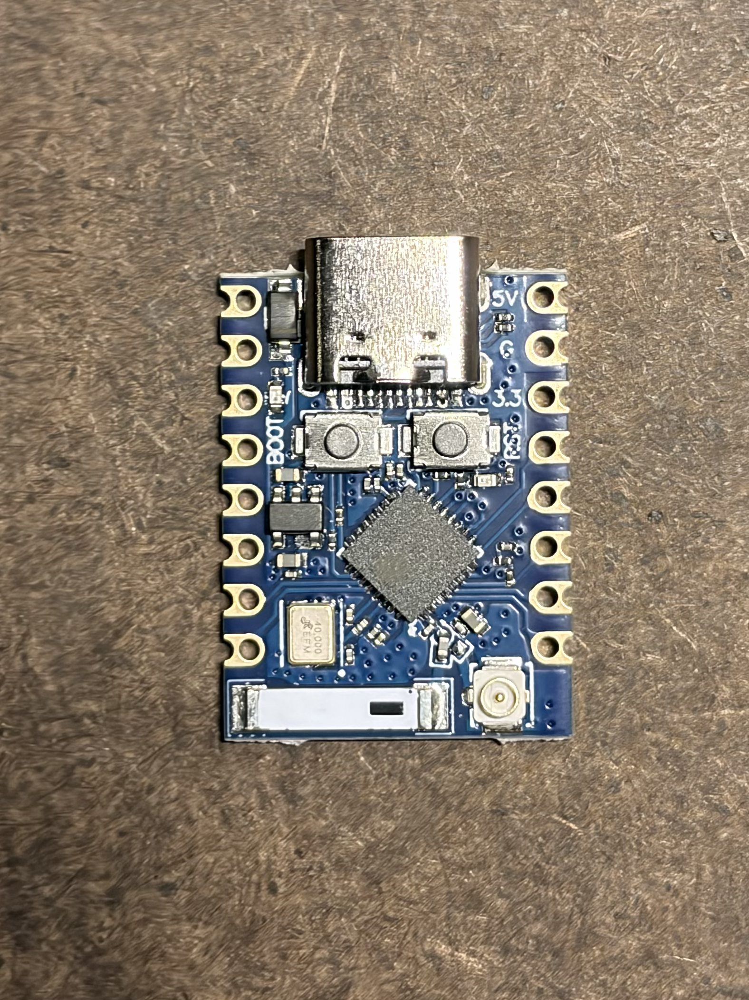

# Installed hardware

The original Realtek controller module has been removed from Michael's original
full-size Elgato Key Light. Its replacement is the blue **ESP32-C3_MINI_V1**
development board with USB-C, BOOT and RESET buttons, and a bare ESP32-C3 package.
It is not an official ESP32-C3-MINI-1U module.

User photo supplied on 2026-09-28, converted from `IMG_3632.heic` to a
1576 × 2102 PNG without cropping or rotation. The board identity comes from its
reported reverse-side `ESP32-C3_MINI_V1` marking. This component-side photo shows
USB-C, the buttons, the onboard antenna component, and the antenna socket; it
does not establish the RF routing, an antenna-switch GPIO, or electrical wiring.
The firmware uses the C3's native USB Serial/JTAG peripheral.

On **2026-09-28**, Michael completed the wiring and powered the assembly from a
13 V bench supply, measuring 3.345 V at ESP `3.3`/`G`. USB identified an ESP32-C3
revision v0.4 with 4 MiB flash. The original image was backed up and real
firmware flashed. The panels were disconnected for bench work. On September 29,
Michael reports both closed-up lamps work well without external antennas, with
solid connections in his current use. Board A runs 0.1.4; board B remains on
0.1.3. This does not establish long-term radio reliability or detailed loaded
startup behavior. Per-board results are in
[the validation record](validation-record.md).

Retain the PCA9635 U3, stock LED power/current-limiting circuitry, LED panels,
housing, and original 13 V / 4 A supply. No PCA pin is lifted. The rocker has
already been bypassed into its working ON state; firmware does not operate it.
The installed design uses the stock regulated rail and five wires. Secure the
board and wiring with insulated mounting and strain relief. It has no added buck
converter, level shifter, pull-ups, output interlock, or connection to the C3 `5V`
pad.

## Exact five-wire map

**Corrected U4 signal map, 2026-09-28:** Michael identified the error at the
Key Light's U4 pads, confirmed the ESP connections are correct, and supplied the
map below. He has confirmed the first board's rework, signal-pin continuity,
and absence of shorts. Both boards have now passed powered PCA writes/readback. The
[validation record](validation-record.md) owns per-board status and powered
results. Remove bench power and USB for rewiring, then check each complete
signal path before powered testing resumes.

Orient the Key Light board with the **white power resistors to the left** and the
**removed U4 module footprint below the PCA9635**. Count only U4's horizontal top
row. Number its pads from **1 at the left**; these positions are not PCA chip
pin numbers or the removed module's datasheet pin numbers.

| Signal | Wire colour | Key Light connection | C3 board pad | Function |
| --- | --- | --- | --- | --- |
| Power | Red | J6 / DEBUG, top-left pad; reported 3.37 V | `3.3` | Direct regulated supply, not a GPIO |
| Ground | Black | J8 / UART, top pad of the left of its two three-pad columns | `G` | Common ground |
| SDA | Yellow | U4 top row, **second from right**; PCA9635 pin 27 | `4` | GPIO4, I²C SDA |
| SCL | Green | U4 top row, **rightmost**; PCA9635 pin 26 | `5` | GPIO5, I²C SCL |
| OE | Blue | U4 top row, **pad 5 from the left, counting from 1**; PCA9635 pin 23 | `6` | GPIO6, active-low output enable |

Michael confirmed these wire colours on 2026-09-28. Use colour plus signal in
bench instructions: for OE voltage, meter COM goes to black/GND and the voltage
probe to blue/OE. These are harness wire colours, not meter-lead colours.

The corrected U4 map matches the existing firmware assignments, so no GPIO
change is required. Leave the correct ESP ends in place. Use printed labels
and end-to-end continuity to verify the rework; the component-side photo alone
does not establish connections. OE remains part of the five-wire design, not
an optional connection or permanently grounded substitute.

## Reported electrical measurements

The four two-pin LED connectors are labelled `F-1`, `F-2`, `W-1`, and `W-2`
(Michael, 2026-09-28). Powered, unloaded Home tests associate both F connectors
with PCA LED0, the firmware's warm channel, and both W connectors with LED4,
the firmware's cool channel. At maximum allowed brightness, the selected bank
measured approximately 13 V and the other near zero; changing temperature
extremes swapped them. The actual panel colours remain unobserved. See the
[validation record](validation-record.md) for the measured states and limits.

The [whole-board photo](references/photos/keylight-3622.png), with the white
power resistors at the top and DC input wires at the bottom, identifies F-1/J1
at upper right, F-2/J3 at lower right, W-1/J5 at upper left and W-2/J4 at lower
left. Each connector's two electrical contacts are the reference endpoints
for the [selected 10 kΩ bleeder trial](off-glow-investigation.md). This does not
map alternate solder pads or establish that same-bank outputs are tied together.

These historical measurements were supplied in the 2026-09-28 handoff and were
not performed by the implementation agent. They do not validate the old signal
map or replace post-rework checks of the corrected connections above.

| Measurement | Reported result |
| --- | ---: |
| DC input | 13 V |
| PCA9635 VDD | 3.37 V |
| Idle SDA, SCL, OE | 3.37 V each |
| SDA-to-VDD, SCL-to-VDD, OE-to-VDD | Approximately 9.9 kΩ each |
| SDA-to-SCL | Approximately 20 kΩ |
| VDD-to-GND, unpowered | Approximately 1 kΩ |
| IC-pin-to-selected-pad continuity | Approximately 0–0.1 Ω |

The readings support existing approximately 10 kΩ pull-ups on SDA, SCL, and OE.
Retain those pull-ups and use a **100 kHz** I²C bus. The stock 3.37 V rail is the
accepted supply for this installation. Its unloaded voltage does not establish
behavior during C3 startup, BLE commissioning, or Wi-Fi transmission. Keep
brownout detection enabled and record reset reasons during bench testing.

## GPIO, USB, and flash constraints

Current firmware assigns GPIO4/SDA, GPIO5/SCL, and GPIO6/OE at 100 kHz, matching
the corrected wiring plan. GPIO4/5/6 have alternate JTAG functions; explicitly
assign their GPIO/I²C functions and do not select external pad JTAG on them.
Use native USB Serial/JTAG on GPIO18/19 for programming and the bidirectional
console. It is not a USB-OTG/TinyUSB mass-storage or DFU interface. Leave other
application GPIOs unused, including any unverified onboard status LED.

Drive GPIO6 as **open-drain**. Set its output latch HIGH before enabling
open-drain output mode. Releasing HIGH lets the existing OE pull-up act; pulling
LOW enables the PCA's configured outputs. The electrical meaning of OE HIGH
depends on MODE2 and does not by itself prove that the lamp is dark.

The first device reported **4 MiB flash**; the firmware requires no PSRAM.
Read chip identity and flash ID/capacity from each connected board before
flashing; do not assume every board sold under this marking has the same flash.
The Rust MCU application targets `esp32c3`. The flash helper must reject a wrong
chip or insufficient capacity before writing. [Development](development.md)
owns build instructions; [bench bring-up](bench-bring-up.md) owns initial flashing
and the physical checks.

The handoff reports both an onboard antenna component and an external antenna
socket visible in the board photos. Antenna routing/selection is hardware; there
is no established firmware antenna-selection GPIO. Do not add one by analogy
with another board. On September 29, Michael confirms no external antennas are
installed and reports solid connections with both lamps closed up. This is a
user observation, not a long-term radio or closed-housing commissioning test.

## USB and power sequence

With **any lamp wiring attached**, power the assembly from the lamp board and
use USB with **VBUS/5 V blocked while USB data and ground remain connected**.
A charging-only cable or a USB data blocker does not provide that arrangement.
Do not connect ordinary powered USB merely because the lamp adapter or bench
PSU is switched off; the shared 3.3 V rail and signal paths remain connected.

Ordinary powered USB is permitted only after disconnecting the C3 from **all
five lamp wires**. Remove USB before restoring those wires. This rule applies
to flashing, console use, recovery, and bench testing alike. Do not rely on USB
back-powering the stock board.

For a future bench session, leave the LED panels disconnected, verify the
bench-supply connection and polarity, and record the chosen voltage and current
limit before energizing the assembly. The reported lamp input is 13 V; no
bench-PSU current limit or loaded-supply measurement has yet been supplied.
Completed bench checks are in the validation record and need not be repeated.

## Controller evidence and physical limits

[Signed stock-firmware analysis](references/firmware-analysis.md) establishes the
following software baseline. These remain firmware evidence, not measurements
of the modified assembly:

| Item | Stock-firmware evidence | Physical evidence or remaining check |
| --- | --- | --- |
| Address and bus rate | Seven-bit `0x15`, 100 kHz | Both wired boards passed PCA writes/readback; bus timing unmeasured |
| Active channels | LED0/warm on pin 6; LED4/cool on pin 10 | Detailed connected-panel bank/output checks remain unrecorded |
| Output mode | `MODE2=0x14`: inverted push-pull, update on STOP, OE-high outputs LOW | External-stage behavior and actual Off |
| 3300 K, nominal 3% | Warm/cool raw PCA PWM values `6/2` | Output observation; these are not optical calibration |
| 5000 K, nominal 3% | Warm/cool raw PCA PWM values `3/6` | Output observation; these are not optical calibration |

The two 3% rows are regression points for the stock mixing model. The selected
control range now maps Home brightness to stock nominal 1–10% and temperature
to 143–344 mired; see [the spec](spec.md). Initial Matter level `57` retains
`6/2` at 303 mired and `3/6` at 200 mired. Do not replace the established channels
with guessed channels or pure warm/cool mixes. If physical observations
contradict this model, record the contradiction before revising it.

The PCA's power-on configuration differs from the configured stock mode. There
is no independent output cutoff, and control of OE cannot guarantee darkness
during ROM boot, cold start, controller reset, brownout, or an I²C failure. Bench
tests with the LEDs disconnected can establish power, USB, GPIO, and controller
communication, but cannot establish light output. Reconnect the LEDs only with
power removed, then observe Off, brightness and temperature changes,
startup/reset behavior, and network recovery separately. A register
acknowledgement/readback is not a measurement of emitted light.

Both assembled lamps now operate well per Michael, but have a faint central
orange glow while Off and powered. Michael confirms that the panel itself
emits it, including at the edges, and rules out the ESP indicator. See the
[glow investigation](off-glow-investigation.md) for the leakage/residual-drive
assessment and verified connector locations. Michael's September 29 resistor
trial visibly dimmed the glow, but residual emission remains. Whether it goes
fully dark after longer Off is unknown; the cause is still unconfirmed. His
report does not confirm the installed resistor values, count or endpoints.
No PCA polarity change, OE pull-down or unverified gate connection is selected.

## Evidence provenance

The board identity, five-wire map, electrical readings, rocker state, and USB
power rule were incorporated from the
[2026-09-28 handoff at commit `a617f1e`](https://github.com/micthiesen/key-right/blob/a617f1e77529d3fb66339c6e1a4e7b3636a03fcf/docs/handoff).
That handoff cites Michael's completed probing worksheet and
`Elgato_Key_Light_C3_Wiring_Field_Guide.pdf`; those attachments are not in this
repository. The handoff text is the available record of their reported findings.
Michael subsequently corrected the guide's U4 signal pad positions to those
listed above and confirmed that the ESP end was correct. The current
[bench guide](bench-bring-up.md) uses that correction and requires post-rework
end-to-end continuity before further powered tests.
