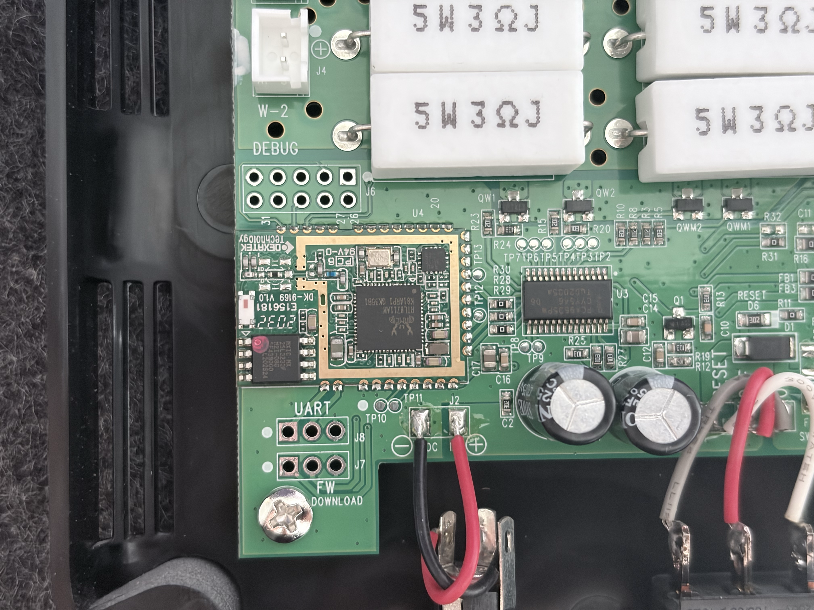

# Reference material

## Photos supplied by the user

Originals copied from `/Volumes/overflow/`:

- `photos/IMG_3622.HEIC`: whole controller/power PCB, LED sockets and power switch.
- `photos/IMG_3623.HEIC`: close-up of Dexatek module, U3, DEBUG, UART and FW DOWNLOAD footprints.
- `photos/IMG_3624.HEIC`: close-up of U3/output circuitry and power/reset area.

Corresponding `keylight-3622.png`, `keylight-3623.png`, and `keylight-3624.png` are full-resolution PNG conversions for tools without HEIC support. `keylight-j6-detail.png` is a crop of 3623 showing J6 and the adjacent module pads. The crop is observational reference, not an annotated or verified pinout.

## Datasheets

- `datasheets/NXP-PCA9635.pdf`: NXP PCA9635, revision 7.1, 2021-07-27. [Source](https://www.nxp.com/docs/en/data-sheet/PCA9635.pdf).
- `datasheets/Dexatek-DK9169.pdf`: Dexatek DK-9169 module specification and EVB guide, issued 2022-01-01. [Source](https://www.dexatek.com/_files/ugd/c97cac_817c1987ed1b49bea26071756f2888f7.pdf).

Downloaded/copied 2026-09-22. Vendor documents remain their respective owners' material. Additional source links and interpretation are in [research.md](../research.md).
